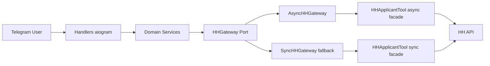
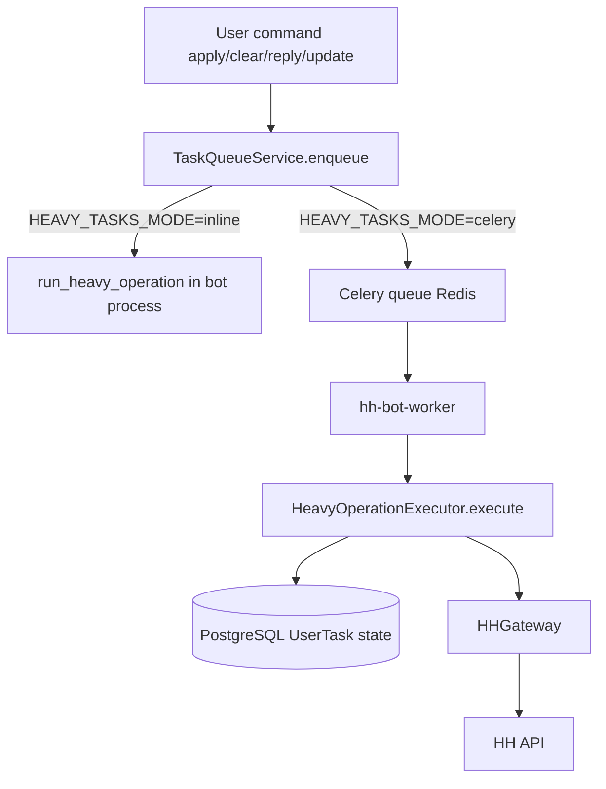
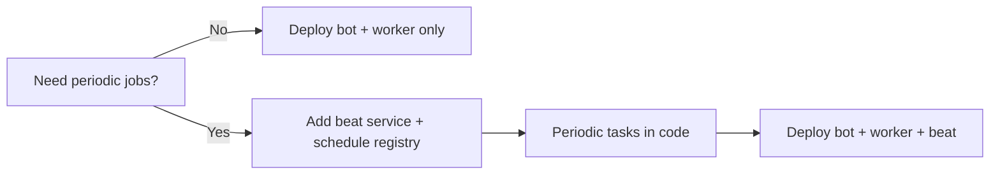

# Архитектура `hh-bot` для этапа async/gateway и фоновых задач

## Обзор проекта

`hh-bot` — Telegram-бот для сценариев соискателя HH (авторизация, работа с резюме, отклики, ответы работодателям), который использует библиотеку `hh-applicant-tool` как интеграционный слой с HH API.

Целевая задача текущего цикла:
- зафиксировать архитектурно корректное продолжение async/gateway рефакторинга;
- добавить понятные комментарии/докстринги к новому функционалу библиотеки (`AsyncApiClient`, async-фасад `HHApplicantTool`);
- определить, нужно ли поднимать `celery-beat`, и какие изменения требуются в деплой-манифесте.

Ограничения и контекст:
- должен сохраняться parity с текущим sync-поведением и форматами хранения токенов/cookies;
- `HEAVY_TASKS_MODE=inline|celery` должен оставаться поддержанным;
- в production критичны надежность I/O, наблюдаемость и предсказуемая конкуренция.

## Текущее состояние архитектуры

### 1) Слои и модули

- **Handlers (`bot/handlers`)**: UI-уровень Telegram/FSM, маршрутизация команд, запуск heavy-операций.
- **Domain services (`bot/services`)**: бизнес-логика (`AuthService`, `ApplyService`, `NegotiationService`, `ResumeService`, `ApiService`).
- **Gateway layer (`bot/services/hh_gateway*`)**:
  - `HHGateway` (порт),
  - `AsyncHHGateway` (primary),
  - `SyncHHGateway` (fallback через threadpool).
- **Heavy execution**:
  - `HeavyOperationExecutor` + `run_heavy_operation()` как единый orchestration entrypoint,
  - запуск из inline и Celery worker по одному контракту.
- **Queue state**:
  - `TaskQueueService` (async, из бота),
  - `SyncTaskStore` (sync, из Celery worker).
- **Библиотека `hh-applicant-tool`**:
  - sync client (`ApiClient`) и новый async client (`AsyncApiClient`),
  - sync + async методы фасада (`get_*` / `aget_*`),
  - lifecycle `aclose()` добавлен.

### 2) Деплой и рантайм

- Фактический деплой описан через `.github/workflows/deploy.yml` + `docker-compose.yml`.
- В `docker-compose.yml` уже есть:
  - `hh-bot` (основной сервис),
  - `hh-bot-worker` (Celery worker),
  - `redis`, `postgres`.
- В workflow deploy сейчас поднимается только `hh-bot` (`docker compose up -d --remove-orphans hh-bot`), то есть worker не гарантированно обновляется/поднимается в рамках деплоя.

### 3) Подтвержденные артефакты состояния

- `plan.md`: план этапов T1-T4 для async/gateway миграции.
- `implemented.md`: E1-E4 закрыты, включая lifecycle, rate-limit, общий heavy executor.
- `artifacts/e4/*`: parity/e2e/perf smoke, verdict `closed`.

## Замечания и некорректности

1. **Симптом**: в deploy workflow поднимается только `hh-bot`, а `hh-bot-worker` не запускается явно.  
   **Причина**: шаг `docker compose up` ограничен одним сервисом.  
   **Риск**: при `HEAVY_TASKS_MODE=celery` задачи ставятся в очередь, но не исполняются после деплоя или после сбоев worker.

2. **Симптом**: в текущем коде бота нет периодических задач Celery (`beat_schedule`, `add_periodic_task`).  
   **Причина**: фоновые операции запускаются только по пользовательскому событию (on-demand).  
   **Риск**: лишний `celery-beat` усложнит эксплуатацию без пользы (доп. процесс, мониторинг, точки отказа).

3. **Симптом**: новый async функционал библиотеки частично документирован только именами методов/докстрингами верхнего уровня.  
   **Причина**: рефакторинг был сосредоточен на поведении и parity, а не на explainability кода.  
   **Риск**: выше стоимость поддержки, больше вероятность неправильного использования async API (особенно rate-limit/retry semantics и lifecycle закрытия).

4. **Симптом**: в `HHApplicantTool` для `api_client` и `async_api_client` `client_secret` берется из `client_id`.  
   **Причина**: дефект инициализации в фасаде библиотеки.  
   **Риск**: нестабильный OAuth refresh на кастомных credentials.

## Целевая корректная архитектура

### 1) Архитектурные границы

- Оставить `HHGateway` единственным входом сервисов в HH API.
- Зафиксировать `AsyncHHGateway` как основной режим для production.
- Сохранить `SyncHHGateway` как контролируемый fallback/compatibility слой (изолированно).
- Сохранить единый контракт тяжёлых операций: `run_heavy_operation()` для inline/celery.

### 2) Документируемость нового async функционала библиотеки

Для `hh-applicant-tool` внедрить целевой стандарт комментариев:
- модульные докстринги с ролью компонента и его границами;
- докстринги публичных async-методов (`aget_*`, `asave_*`, `arefresh_*`, `aclose`) с семантикой side effects;
- краткие инлайн-комментарии только для неочевидных участков:
  - атомарное резервирование rate-limit слота (`_next_request_time` + lock),
  - стратегия retry/backoff и набор retriable статусов,
  - sync/async token synchronization в gateway.

Это не "комментарии ради комментариев", а фиксация invariants для поддержки и ревью.

### 3) Фоновые задачи и планировщик

- `celery-worker` обязателен, если `HEAVY_TASKS_MODE=celery`.
- `celery-beat` вводится **только** при наличии периодических доменных/технических задач (см. критерии ниже).
- Пока периодических задач в `bot` нет, архитектурно корректная конфигурация: **без `celery-beat`**.

### 4) Целевой deploy-манифест

В текущей модели деплоя (GitHub Actions + docker compose):
- всегда обновлять и поднимать `hh-bot` + `hh-bot-worker`, если `HEAVY_TASKS_MODE=celery`;
- `hh-bot-beat` добавлять и запускать только при активированных periodic jobs;
- проверить health/readiness для worker/beat (минимум: процесс поднят, брокер доступен).

## Паттерны и технологии

- **Hexagonal boundary (облегченный)**: `bot/services` зависит от порта `HHGateway`, а не от конкретного HTTP-клиента.
- **Adapter**: `AsyncHHGateway` и `SyncHHGateway`.
- **Strategy**: inline/celery стратегии исполнения heavy-операций через единый orchestration entrypoint.
- **Facade**: `HHApplicantTool` как фасад sync/async API библиотеки.
- **Tech stack**:
  - `httpx.AsyncClient` для async I/O,
  - `Celery + Redis` для очередей,
  - `PostgreSQL` для состояния задач/данных,
  - `aiogram` для Telegram bot runtime.

## Диаграммы (Mermaid)

## План миграции

### Этап M1 (высокий приоритет): комментарии и документация нового async-функционала библиотеки

- Область: `hh-applicant-tool/src/hh_applicant_tool/api/async_client.py`, `hh-applicant-tool/src/hh_applicant_tool/main.py`, при необходимости `api/__init__.py`.
- Действия:
  - добавить/уточнить докстринги публичных async API и lifecycle;
  - добавить короткие комментарии к алгоритму rate-limit/retry;
  - обновить комментарии про совместимость sync/async путей.
- Эффект: ускорение ревью/поддержки, меньше риск ошибочной модификации конкурентной логики.
- Риск: незначительное увеличение объема кода; минимальный.

### Этап M2 (высокий приоритет): исправить деплой под рабочий Celery режим

- Область: `.github/workflows/deploy.yml`.
- Действия:
  - после миграций выполнять `docker compose up -d --remove-orphans hh-bot hh-bot-worker`;
  - при включении periodic jobs дополнить `hh-bot-beat`.
- Эффект: исключение "висящих" queued задач после релиза.
- Риск: дополнительная нагрузка на хост; требуется контроль ресурсов.

### Этап M3 (средний приоритет): критерии включения `celery-beat` и эксплуатационный флаг

- Область: архитектурные правила + env/deploy docs.
- Действия:
  - ввести явный флаг вида `ENABLE_CELERY_BEAT=true|false`;
  - добавлять beat только при наличии production-периодик;
  - описать ownership и SLA для расписаний.
- Эффект: прозрачное управление сложностью и инфраструктурными процессами.
- Риск: без дисциплины конфигурации возможна рассинхронизация между кодом и деплоем.

### Этап M4 (средний приоритет): закрыть известные дефекты совместимости OAuth

- Область: `hh-applicant-tool/src/hh_applicant_tool/main.py`.
- Действия: исправить передачу `client_secret`, добавить тест инициализации.
- Эффект: стабильность refresh/auth при кастомной конфигурации.
- Риск: потенциальное изменение поведения у окружений с неконсистентным конфигом; нужен smoke.

## Критерии необходимости `celery-beat` и изменения в деплой-манифесте

`celery-beat` **нужен**, если выполняется хотя бы одно:
- есть периодические бизнес-задачи (например, авто-обновление резюме по расписанию);
- есть регулярные технические задачи (TTL cleanup, reconciliation зависших задач, агрегатные метрики, регулярный refresh токенов без пользовательского триггера);
- есть требования по SLA на запуск задач "каждые N минут/в конкретное время".

`celery-beat` **не нужен**, если:
- все heavy-операции запускаются только по пользовательскому событию;
- нет cron-подобных требований в продуктовых сценариях;
- техобслуживание выполняется ad-hoc или внешним orchestrator (не Celery beat).

Изменения в деплой-манифесте:
- **Сейчас (рекомендуемо немедленно):**
  - запускать `hh-bot` и `hh-bot-worker` вместе при деплое.
- **При появлении periodic tasks:**
  - добавить сервис `hh-bot-beat` (команда `celery ... beat`),
  - поднять его в deploy workflow вместе с ботом и worker,
  - задать правила singleton/lock для периодических задач (чтобы избежать дублей).

## Почему это лучше (обоснование и trade-offs)

- Плюсы:
  - сохраняется практичная async-first архитектура с изолированным fallback;
  - уменьшается операционный риск Celery-режима за счет корректного деплоя worker;
  - документируемость async-функционала снижает стоимость дальнейшего рефакторинга;
  - `celery-beat` вводится по фактической необходимости, без преждевременного усложнения.

- Цена решений:
  - больше требований к дисциплине деплоя/конфигурации;
  - дополнительный сервис (beat) при переходе к периодике потребует мониторинга и ownership;
  - комментарии и докстринги требуют поддержки при последующих изменениях API.

- Баланс:
  - архитектура остается достаточно простой для текущего масштаба;
  - расширяемость под периодические события предусмотрена заранее;
  - инфраструктурная сложность добавляется только при подтвержденной продуктовой потребности.
